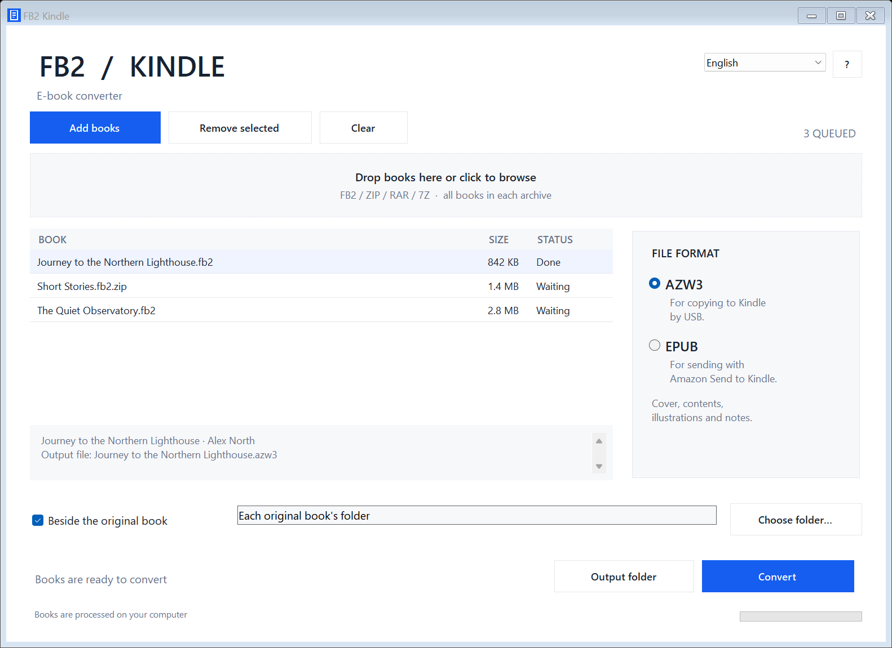

# FB2 Kindle

[English](#english) · [Русский](#русский) · [简体中文](#简体中文)

A Windows desktop converter from FB2 to EPUB and AZW3, with drag and drop, batch conversion, and ZIP, RAR, and 7Z support.



**[Download the Windows installer](https://github.com/MerryGrim/fb2-kindle/releases/latest)** · [All releases](https://github.com/MerryGrim/fb2-kindle/releases) · [Author](https://github.com/MerryGrim)

## English

FB2 Kindle turns individual FB2 books and book archives into separate EPUB or AZW3 files. Add files with the button or drag them into the window, choose an output format and folder, and start conversion. Books inside an archive appear as individual entries in the queue. Existing files are preserved; duplicate names receive a number.

- **Inputs:** FB2, ZIP, RAR, and 7Z, including archives containing multiple books.
- **Outputs:** EPUB for Amazon Send to Kindle and compatible readers; AZW3 for direct USB transfer to a compatible Kindle.
- **Languages:** English, Russian, and Simplified Chinese. Switch the application language from the main window.
- **Local processing:** conversion runs on your computer. The app saves files; it does not upload books or manage a connected device.
- **Interface:** a clean, restrained DMR Zone style, with a separate About window for version information, credits, licenses, and the author's GitHub profile.

### Installation

Download the installer from [Releases](https://github.com/MerryGrim/fb2-kindle/releases/latest). It includes the conversion and archive engines for offline use. Select English, Русский, or 简体中文, then follow the welcome screen and installation steps.

**Requirements:** Windows 10 or 11, x64, and .NET Framework 4.8. Password-protected archives must be unpacked first. A single FB2 book is limited to 96 MiB. Some named FB2 styles are simplified; rendering depends on the reader and its firmware.

EPUB is intended for Send to Kindle or another EPUB-compatible reader. For ordinary USB transfer to Kindle, choose AZW3. Simply copying an EPUB file to a Kindle does not convert it.

### License

The application's own source code, documentation, and assets are licensed under [MIT](LICENSE), © 2026 MerryGrim. Calibre, 7-Zip, and Inno Setup retain their own licenses; MIT does not cover them. See [THIRD-PARTY-NOTICES.md](THIRD-PARTY-NOTICES.md).

## Русский

FB2 Kindle превращает отдельные FB2-книги и архивы с книгами в самостоятельные файлы EPUB или AZW3. Добавьте файлы кнопкой или перетащите их в окно, выберите формат и папку сохранения, затем запустите конвертацию. Каждая книга из архива появляется отдельной строкой в очереди. Существующие файлы сохраняются; одинаковые названия получают номера.

- **Входные форматы:** FB2, ZIP, RAR и 7Z, включая архивы с несколькими книгами.
- **Выходные форматы:** EPUB для Amazon Send to Kindle и совместимых читалок; AZW3 для прямого переноса по USB на совместимый Kindle.
- **Языки:** Русский, English и 简体中文. Переключатель языка находится в главном окне.
- **Локальная работа:** конвертация выполняется на вашем компьютере. Программа сохраняет файлы, не отправляет книги на сервер и не управляет подключённой читалкой.
- **Интерфейс:** строгий стиль DMR Zone; версии, авторство, лицензии и профиль автора на GitHub собраны в окне «О приложении».

### Установка

Скачайте установщик из [Releases](https://github.com/MerryGrim/fb2-kindle/releases/latest). Движки конвертации и распаковки уже включены — для работы интернет не нужен. Выберите Русский, English или 简体中文 и пройдите приветственный экран и шаги установки.

**Требования:** Windows 10 или 11, x64, и .NET Framework 4.8. Парольные архивы предварительно распакуйте. Предел одной FB2-книги — 96 МиБ. Некоторые именованные стили FB2 упрощаются; отображение зависит от читалки и её прошивки.

EPUB предназначен для Send to Kindle и других совместимых читалок. Для обычного переноса на Kindle по USB выбирайте AZW3: простое копирование EPUB не преобразует книгу.

### Лицензия

Собственный код, документация и ресурсы программы распространяются по [MIT](LICENSE), © 2026 MerryGrim. Calibre, 7-Zip и Inno Setup сохраняют свои лицензии; MIT на них не распространяется. Подробности: [THIRD-PARTY-NOTICES.md](THIRD-PARTY-NOTICES.md).

## 简体中文

FB2 Kindle 可将单本 FB2 电子书或包含多本书的压缩包转换为独立的 EPUB 或 AZW3 文件。点击按钮添加文件，或将文件拖入窗口；选择输出格式和保存文件夹，然后开始转换。压缩包中的每本书都会单独列入队列。现有文件不会被覆盖，重名文件会自动添加编号。

- **输入格式：** FB2、ZIP、RAR 和 7Z，支持包含多本书的压缩包。
- **输出格式：** EPUB 可用于 Amazon Send to Kindle 和兼容阅读器；AZW3 可通过 USB 直接传输至兼容的 Kindle。
- **界面语言：** 英语、俄语和简体中文，可在主窗口切换。
- **本地处理：** 转换在您的电脑上完成。程序只生成文件，不会上传电子书，也不会管理连接的阅读设备。
- **界面风格：** 简洁、严谨的 DMR Zone 风格。“关于”窗口提供版本信息、作者信息、许可证及作者的 GitHub 主页链接。

### 安装

从 [Releases](https://github.com/MerryGrim/fb2-kindle/releases/latest) 下载安装程序。安装包已包含转换和解压引擎，可离线使用。选择 English、Русский 或 简体中文，然后按照欢迎页面及后续步骤完成安装。

**系统要求：** Windows 10 或 11（x64），以及 .NET Framework 4.8。加密压缩包需要先自行解压。单本 FB2 文件上限为 96 MiB。部分 FB2 命名样式会被简化，实际显示效果取决于阅读器及其固件。

EPUB 适用于 Send to Kindle 或其他支持 EPUB 的阅读器。通过 USB 直接传输至 Kindle 时，请选择 AZW3；仅复制 EPUB 文件不会将其转换为 Kindle 格式。

### 许可证

本程序自行编写的源代码、文档和资源采用 [MIT 许可证](LICENSE)，© 2026 MerryGrim。Calibre、7-Zip 和 Inno Setup 保留各自的许可证，MIT 许可证不适用于这些第三方组件。详情请参阅 [THIRD-PARTY-NOTICES.md](THIRD-PARTY-NOTICES.md)。

## Building from source

The source repository contains no bundled engines or books. To build the application on Windows with .NET Framework 4.8, run PowerShell from the repository root:

```powershell
.\source\build.ps1
.\FB2Kindle.exe
```

No external packages are required to compile the app. Keep `FB2Kindle.exe.config` next to the executable.

Ordinary FB2 → EPUB conversion uses the app's own code. For AZW3, install [Calibre](https://calibre-ebook.com/download_windows); the app finds a standard installation or `ebook-convert.exe` on `PATH`. For RAR and 7Z, install [7-Zip x64](https://www.7-zip.org/). Some unusual ZIP entry names also require 7-Zip.

Alternatively, supply the unchanged portable engines alongside the executable:

```text
engine/
  Calibre/       ebook-convert.exe, with its complete portable runtime
  Archive7z/     7z.exe and 7z.dll
```

Calibre needs its full portable directory, including libraries and resources.

### Command line

```text
FB2Kindle.exe --convert "C:\Books\book.fb2" "C:\Books\book.epub"
FB2Kindle.exe --convert "C:\Books\book.fb2" "C:\Books\book.azw3"
```

The destination file must not already exist. In command-line mode, an archive must contain exactly one FB2 book. Exit codes: `0` for success, `1` for an error.

### Building the installer

Install [Inno Setup 7.1 or newer](https://jrsoftware.org/isdl.php). The build script finds `ISCC.exe` on `PATH` or in its standard installation folder.

For the complete offline installer, first prepare `engine/` with the full, unchanged Calibre and 7-Zip runtimes, their licenses and copyright notices, and the corresponding source archives. Include the Inno Setup license at `engine/InnoSetup/LICENSE.txt`. These components are not included in this repository. Follow their distribution requirements in [THIRD-PARTY-NOTICES.md](THIRD-PARTY-NOTICES.md).

```powershell
.\source\installer\build-installer.ps1
```

The installer is written to the parent directory by default. When invoking `ISCC.exe` directly, `/DAppSource` and `/DReleaseDir` override the source and output directories.

Release validation covers conversion, archives, the interface, and installation, upgrade, and uninstall scenarios. Transfer to a physical Kindle and the Send to Kindle service have not been tested.
